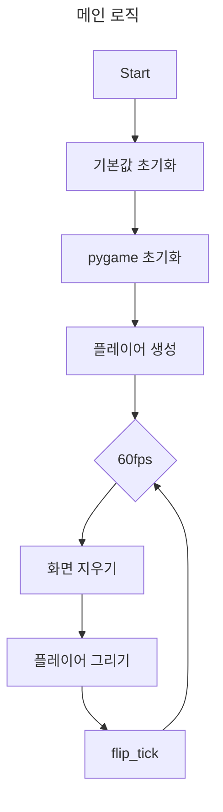
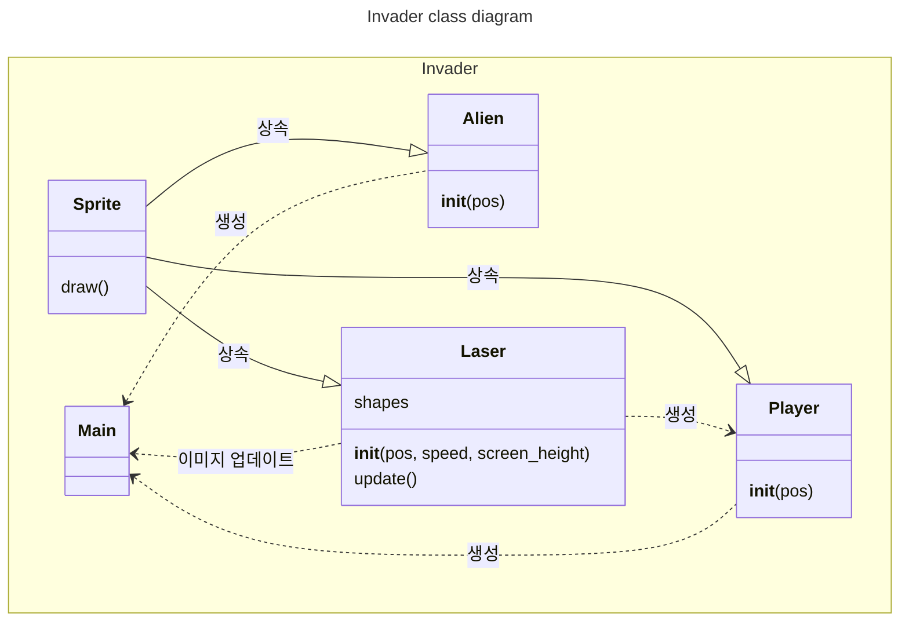
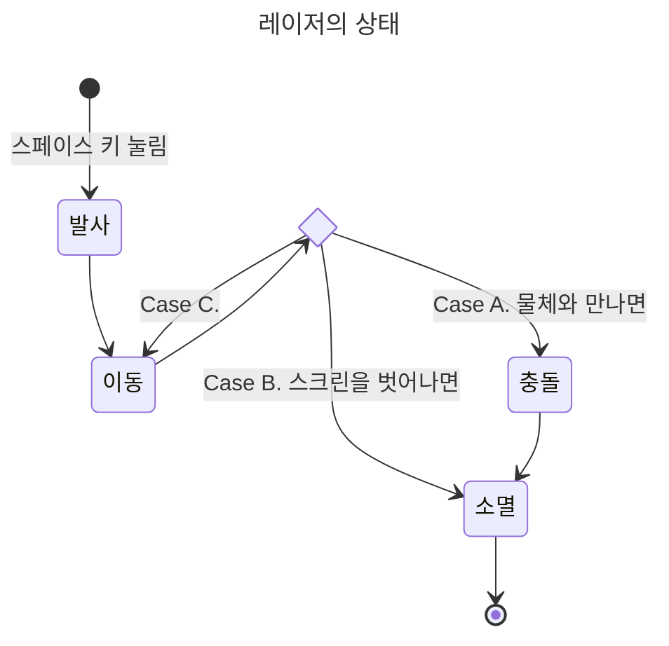

# 인베이더 게임의 클래스 관계도

설계를 위해서 이런걸 많이 사용한다.

```mermaid
---
title: 메인 로직
---
flowchart
  Start --> init_val["기본값 초기화"]
  init_val --> init_pygame["pygame 초기화"]
  init_pygame --> create_player["플레이어 생성"]
  create_player --> loop{60fps}
  loop --> screen_fill["화면 지우기"]
  screen_fill --> draw_player["플레이어 그리기"]
  draw_player --> flip_tick
  flip_tick --> loop
```

```mermaid
---
title: Invader class diagram
---

classDiagram
namespace Invader {
  class Sprite {
    draw()
  }
  class Player {
    __init__(pos)
  }
  class Alien {
    __init__(pos)
  }
  class Laser {
    __init__(pos, speed, screen_height)
    shapes
    update()
  }

  class Main

}

Sprite --|> Player : 상속
Sprite --|> Alien : 상속
Sprite --|> Laser : 상속

Laser ..> Player : 생성

Main <.. Player : 생성
Main <.. Alien : 생성
Main <.. Laser : 이미지 업데이트
```

```mermaid
---
title: 레이저의 상태
---
stateDiagram-v2
  state if_state <<choice>>

  [*] --> 발사 : 스페이스 키 눌림
  발사 --> 이동
  이동 --> if_state

  if_state --> 충돌: Case A. 물체와 만나면
  if_state --> 소멸: Case B. 스크린을 벗어나면
  if_state --> 이동: Case C.

  충돌 --> 소멸
  소멸 --> [*]
```